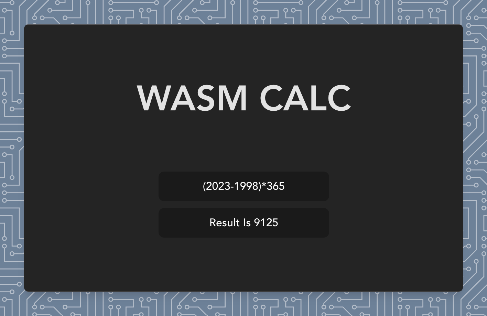

  

A simple calculator written in TinyGo and compiled to WebAssembly

 

<a href="https://wasm-calc.netlify.app/">Live Demo</a>

 

简体中文

 

## Features

- ⚡️ [Vue 3](https://github.com/vuejs/core)+[Vite](https://github.com/vitejs/vite)+[pnpm](https://pnpm.io/), 怎么快怎么来
- 🔎 [TinyGo](https://tinygo.org/) 追求最小打包体积
- 🔥 [wasm](https://webassembly.org/) 玩的就是wasm
- 🦾 Golang, of course
- ☁️ Deploy on Netlify

 
